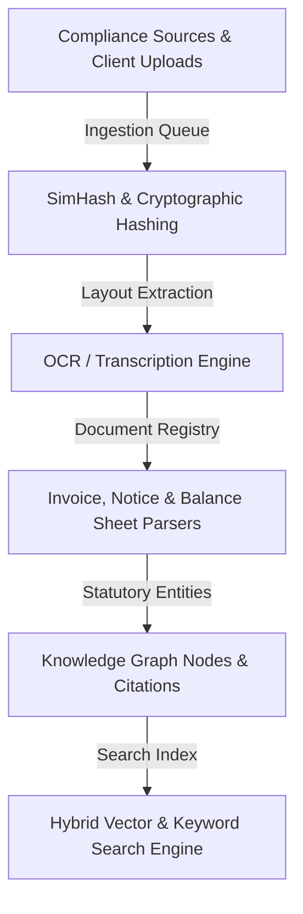

# CA Intelligence

**AI Operating System for Indian Chartered Accountants.**

CA Intelligence is a full-stack enterprise data and compliance platform designed specifically for Indian Chartered Accountants (CAs) and firm partners. It enables firms to manage clients, documents, compliance records, circulars, tax research, and internal firm intelligence. The architecture is designed to integrate with the practice management system **AKKC** through API connections.

---

## Technical Architecture & Lifecycle Layers

The platform is designed around 5 layers of ingestion and versioning:



### 1. Ingestion & Connectors (Phase 3)
18 authoritative government connectors conform to the `BaseConnector` interface, implementing scrapers, download streams, and checksum validation:
- **Direct Tax**: Income Tax (ERI compatible), CBDT Circulars.
- **Indirect Tax**: CBIC Circulars (GST/Customs), GST Council Updates, Advance Rulings.
- **Corporate & Banking**: MCA Public Filings, RBI Notifications, SEBI Circulars.
- **Judicial & Legislation**: e-Gazette, Supreme Court, High Courts, CESTAT Appeals.
- **Ministry & Reference**: Ministry of Finance Releases, Budget Speeches, Finance Bills, FAQs, DPIIT Press Notes.

### 2. Versioning & Change Detection (Phase 3)
- Paragraph-level difference calculation detects additions and removals.
- Tracks amendments to referenced rules and law sections (e.g. tracking when Section 143(1) is updated in a subsequent circular).

### 3. Deduplication & Ingestion Pipeline (Phase 2)
- Cryptographic hash checks (SHA-256/MD5) avoid duplicate file uploads.
- **SimHash** (locality-sensitive hashing) detects near-duplicates using Hamming distance checks.
- Document-level fact parsers extract entities (GSTINs, PANs, Assessment Years, HSNs, demand values).

### 4. Client Workspace & AKKC Integration (Phase 1)
- Multi-tenant organization isolation.
- Integration framework syncing clients, task cards, and billing logs from the AKKC practice management platform.

---

## Tech Stack

- **Frontend**: Next.js (App Router), TypeScript, Tailwind CSS, Radix UI.
- **Backend**: FastAPI (Python), SQLAlchemy ORM, Pydantic (V2), Alembic.
- **Database**: PostgreSQL (Neon in production/staging, SQLite for local dev).
- **Storage**: Modular storage engine (local file storage / AWS S3 placeholders).

---

## Environment Variables

### Backend Configuration (`backend/.env`)
```env
ENV=production
DATABASE_URL=postgresql://<user>:<password>@<neon-host>/<database>?sslmode=require&channel_binding=require
JWT_SECRET=<generate a long random secret - never reuse the local dev default>
JWT_ALGORITHM=HS256
ACCESS_TOKEN_EXPIRE_MINUTES=1440
CORS_ORIGINS=http://localhost:3000,https://ca-intelligence-frontend.vercel.app

# Providers (Set API keys if using live LLM/OCR)
LLM_PROVIDER=mock
EMBEDDING_PROVIDER=mock
OCR_PROVIDER=mock

# Storage
STORAGE_PROVIDER=local
LOCAL_STORAGE_DIR=./uploads
```

### Frontend Configuration (`frontend/.env.local`)
```env
NEXT_PUBLIC_API_URL=https://ca-intelligence-backend.onrender.com
```

---

## Setup & Local Development

### Prerequisites
- Python 3.14+
- Node.js 18+ & npm

### 1. Run Backend
```bash
cd backend
python -m venv venv
source venv/bin/activate
pip install -r requirements.txt
cp ../.env.example .env
alembic upgrade head
uvicorn app.main:app --reload --port 8000
```
API docs: [http://localhost:8000/docs](http://localhost:8000/docs).

### 2. Run Frontend
```bash
cd frontend
npm install
npm run dev
```
Dashboard: [http://localhost:3000](http://localhost:3000).

---

## Verification & Testing

### Run Backend Pytests
```bash
cd backend
PYTHONPATH=. venv/bin/pytest
```

### Build Frontend Production Assets
```bash
cd frontend
npm run build
```

---

## Deployment & Staging Setup

1. **Database**: Applied migrations and seeded tables on Neon Postgres.
2. **Backend**: Deploy Python FastAPI to Render or Railway (requires persistent server runtime to execute the background scheduler thread loops).
3. **Frontend**: Deploy Next.js to Vercel, pointing `NEXT_PUBLIC_API_URL` to your live backend endpoint.
