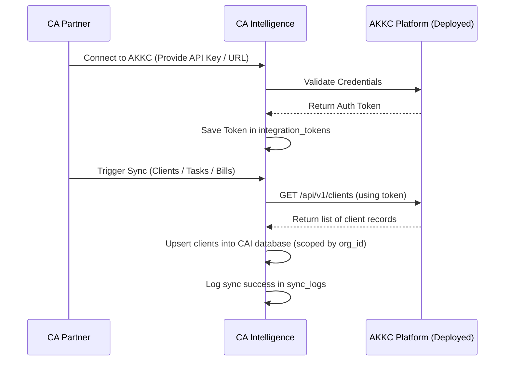

# AKKC Integration Plan

This document details the architectural plan to integrate **CA Intelligence** with the existing **AKKC** practice management and productivity system.

---

## 1. Architectural Strategy

To keep both systems clean and maintainable, CA Intelligence does **not** share a database with AKKC. Instead, they interact via safe REST APIs. 

1. **AKKC** functions as the master system for:
   - Timesheets, billable hours, and client invoicing.
   - CA employee listings, article assistant tracking, and daily task management.
2. **CA Intelligence** functions as the AI layer for:
   - File processing, document OCR, tax extraction, and vector index search.
   - Notice reply generation and direct/indirect tax compliance queries.

---

## 2. Integration Database Schema Scaffolding

To prepare for sync and authentication, CA Intelligence uses three database tables:

- **`external_systems`**: Identifies integrated platforms (e.g., name="AKKC", status="ACTIVE", base_url).
- **`integration_tokens`**: Encrypts and stores API access/refresh tokens and credentials generated during oauth or token exchange.
- **`sync_logs`**: Audits every sync cycle (status: SUCCESS/FAILED, records synced, timestamps).

---

## 3. Data Synchronization Flow

---

## 4. API Endpoints in CA Intelligence (Phase 1 Placeholders)

- **`POST /api/v1/integrations/akkc/connect`**
  - **Payload**: `{ "api_key": "string", "base_url": "string" }`
  - **Purpose**: Authenticates the CA firm's workspace with their AKKC instance.
- **`GET /api/v1/integrations/akkc/status`**
  - **Response**: `{ "connected": true, "last_synced_at": "timestamp", "system_url": "url" }`
  - **Purpose**: Check connection status in dashboard.
- **`POST /api/v1/integrations/akkc/sync/clients`**
  - **Response**: `{ "status": "completed", "synced_count": 25 }`
  - **Purpose**: Pull client records from AKKC into CA Intelligence workspaces.
- **`POST /api/v1/integrations/akkc/sync/tasks`**
  - **Response**: `{ "status": "completed", "synced_count": 142 }`
  - **Purpose**: Pull pending tasks to allow CAs to upload files directly against tasks.
- **`POST /api/v1/integrations/akkc/sync/bills`**
  - **Response**: `{ "status": "completed", "synced_count": 12 }`
  - **Purpose**: Pull pending billings to show outstanding client dues.
