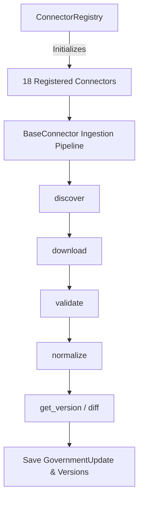

# Compliance Source Connector Architecture

This document describes the design, execution lifecycle, and error-handling principles of the **Compliance Source Connector Framework** in **CA Intelligence**.

---

## Connector Framework Overview

Every external government compliance source is managed by an independent connector class. All connectors inherit from the abstract base class `BaseConnector` inside `app.services.connectors.base` and register inside the `ConnectorRegistry` singleton.



---

## The Abstract Interface (`BaseConnector`)

Every connector implements the following core contract:

```python
class BaseConnector(ABC):
    @abstractmethod
    def get_name(self) -> str:
        """Returns unique display name (e.g. 'CBDT Circulars')"""
        pass

    @abstractmethod
    def get_authority(self) -> str:
        """Returns issuing body (e.g. 'Central Board of Direct Taxes')"""
        pass

    @abstractmethod
    def get_category(self) -> str:
        """Returns regulatory category (e.g. 'Direct Tax')"""
        pass

    @abstractmethod
    def discover(self, db: Session) -> List[Dict[str, Any]]:
        """Queries source portal to check for new updates metadata"""
        pass

    @abstractmethod
    def download(self, url: str) -> bytes:
        """Downloads the raw update file content bytes"""
        pass

    @abstractmethod
    def extract_metadata(self, content: bytes, text: str) -> Dict[str, Any]:
        """Extracts issue dates, sections, and keywords"""
        pass

    @abstractmethod
    def validate(self, content: bytes) -> bool:
        """Verifies file content (length, format) is safe"""
        pass

    @abstractmethod
    def normalize(self, text: str) -> str:
        """Formats layout plain text into clean Markdown representation"""
        pass

    @abstractmethod
    def get_version(self, db: Session, doc_num: str) -> int:
        """Resolves file version based on database logs"""
        pass

    @abstractmethod
    def schedule(self) -> str:
        """Returns cron frequency string (e.g. DAILY, HOURLY)"""
        pass

    @abstractmethod
    def health_check(self) -> str:
        """Validates endpoint availability, returning HEALTHY or DOWN"""
        pass
```

---

## 18 Initial Active Connectors

Connectors are defined in `app.services.connectors.sources.compliance_sources` and cover Direct/Indirect Tax, Corporate Filings, and Judicial Precedents:
1. **Income Tax (ERI)**: Integrates with e-Filing ERI tax return submission APIs.
2. **CBDT Circulars**: Crawford Direct Tax guidelines & Section 119 reliefs.
3. **CBIC Circulars**: Indirect Tax GST circulars, Customs notifications.
4. **GST Council**: Meeting decisions and minutes logs.
5. **MCA Public Documents**: Filings under the Companies Act.
6. **ICAI Announcements**: Code of ethics and Standards on Auditing (SAs).
7. **RBI Notifications**: Monetary directives and KYC Master Directions.
8. **SEBI Circulars**: Disclosures and capital market regulations.
9. **e-Gazette**: Acts published by the Department of Publication.
10. **Supreme Court Judgments**: Judicial precedents of tax benches.
11. **High Court Judgments**: State-level precedents on Indirect/Direct Tax appeals.
12. **CESTAT Orders**: Customs & Excise tribunal decisions.
13. **Advance Rulings**: AAR ruling reports.
14. **Finance Ministry Press Releases**: Ministry announcements.
15. **Union Budget Documents**: Budget Speech and allocations data.
16. **Finance Bills**: Proposed tax rate amendment bills.
17. **Official FAQs**: Portal helpdesk user guides.
18. **Government Press Notes**: FDI circulars issued by DPIIT.
