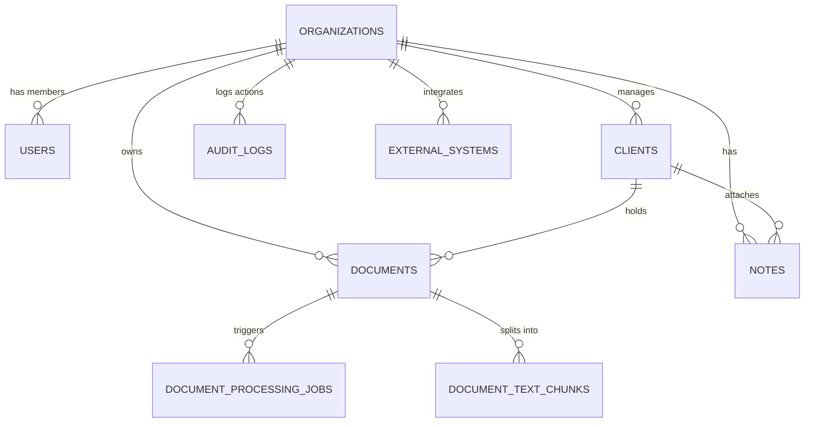

# Database Schema Documentation

This document describes the database design for the **CA Intelligence** MVP foundation.

---

## 1. Entity Relationship Overview

The schema is built around multi-tenancy. Every core entity (users, clients, documents, notes, etc.) is scoped to a specific CA firm through the `organization_id` column.

---

## 2. Table Specifications

### 2.1 Table: `organizations`
Stores the CA Firm (Tenant) details.
- `id`: UUID (Primary Key)
- `organization_name`: VARCHAR(255)
- `firm_type`: VARCHAR(100) (e.g. Proprietorship, Partnership, LLP, Company)
- `GSTIN`: VARCHAR(15) (Nullable)
- `PAN`: VARCHAR(10) (Nullable)
- `address`: TEXT (Nullable)
- `contact_email`: VARCHAR(255)
- `phone`: VARCHAR(20) (Nullable)
- `subscription_plan`: VARCHAR(50) (e.g. Free, Growth, Enterprise)
- `created_at`: TIMESTAMP WITH TIME ZONE
- `updated_at`: TIMESTAMP WITH TIME ZONE
- `deleted_at`: TIMESTAMP WITH TIME ZONE (Nullable - for Soft Delete)

### 2.2 Table: `users`
Stores user details for firm staff and super admins.
- `id`: UUID (Primary Key)
- `organization_id`: UUID (Foreign Key -> organizations.id)
- `email`: VARCHAR(255) (Unique)
- `hashed_password`: VARCHAR(255)
- `first_name`: VARCHAR(100)
- `last_name`: VARCHAR(100)
- `role`: VARCHAR(50) (SUPER_ADMIN, FIRM_ADMIN, PARTNER, MANAGER, EMPLOYEE, ARTICLE_ASSISTANT, CLIENT_USER)
- `is_active`: BOOLEAN
- `created_at`: TIMESTAMP WITH TIME ZONE
- `updated_at`: TIMESTAMP WITH TIME ZONE
- `deleted_at`: TIMESTAMP WITH TIME ZONE (Nullable)

### 2.3 Table: `clients`
Stores clients of the CA firm.
- `id`: UUID (Primary Key)
- `organization_id`: UUID (Foreign Key -> organizations.id)
- `client_name`: VARCHAR(255)
- `client_type`: VARCHAR(50) (Individual / Proprietorship / Partnership / LLP / Company / Trust / HUF / Other)
- `PAN`: VARCHAR(10) (Nullable)
- `GSTIN`: VARCHAR(15) (Nullable)
- `CIN_LLPIN`: VARCHAR(21) (Nullable)
- `TAN`: VARCHAR(10) (Nullable)
- `registered_address`: TEXT (Nullable)
- `contact_person`: VARCHAR(100) (Nullable)
- `contact_email`: VARCHAR(255) (Nullable)
- `contact_phone`: VARCHAR(20) (Nullable)
- `industry`: VARCHAR(100) (Nullable)
- `status`: VARCHAR(50) (ACTIVE / INACTIVE / ARCHIVED)
- `created_at`: TIMESTAMP WITH TIME ZONE
- `updated_at`: TIMESTAMP WITH TIME ZONE
- `deleted_at`: TIMESTAMP WITH TIME ZONE (Nullable)

### 2.4 Table: `documents`
Stores metadata of client files uploaded to the workspace.
- `id`: UUID (Primary Key)
- `organization_id`: UUID (Foreign Key -> organizations.id)
- `client_id`: UUID (Foreign Key -> clients.id, Nullable)
- `name`: VARCHAR(255)
- `file_path`: VARCHAR(512)
- `file_size`: INTEGER
- `mime_type`: VARCHAR(100)
- `category`: VARCHAR(100) (Income Tax Return, Form 16, Balance Sheet, GST Return, etc.)
- `processing_status`: VARCHAR(50) (PENDING, PROCESSING, COMPLETED, FAILED)
- `extracted_text`: TEXT (Nullable)
- `embedding_status`: VARCHAR(50) (PENDING, COMPLETED, FAILED)
- `created_at`: TIMESTAMP WITH TIME ZONE
- `updated_at`: TIMESTAMP WITH TIME ZONE
- `deleted_at`: TIMESTAMP WITH TIME ZONE (Nullable)

### 2.5 Table: `document_processing_jobs`
Logs background processing attempts.
- `id`: UUID (Primary Key)
- `organization_id`: UUID (Foreign Key -> organizations.id)
- `document_id`: UUID (Foreign Key -> documents.id)
- `job_type`: VARCHAR(50) (OCR, EMBEDDING, INDEX)
- `status`: VARCHAR(50) (PENDING, PROCESSING, SUCCESS, FAILED)
- `error_message`: TEXT (Nullable)
- `created_at`: TIMESTAMP WITH TIME ZONE
- `updated_at`: TIMESTAMP WITH TIME ZONE

### 2.6 Table: `document_text_chunks`
Stores parsed document pages/paragraphs for vector search.
- `id`: UUID (Primary Key)
- `document_id`: UUID (Foreign Key -> documents.id)
- `chunk_index`: INTEGER
- `text_content`: TEXT
- `embedding_vector`: VECTOR(1536) (pgvector type, Nullable)
- `created_at`: TIMESTAMP WITH TIME ZONE

### 2.7 Table: `compliance_sources`
Catalog of verified compliance source APIs and links.
- `id`: UUID (Primary Key)
- `source_name`: VARCHAR(255)
- `category`: VARCHAR(100) (Direct Tax, Indirect Tax, Corporate Law, etc.)
- `official_url`: VARCHAR(512)
- `access_type`: VARCHAR(50) (API / RSS / Scraping / Manual Upload / Paid API / GSP / ERI)
- `requires_auth`: BOOLEAN
- `update_frequency`: VARCHAR(100)
- `last_checked_at`: TIMESTAMP WITH TIME ZONE (Nullable)
- `status`: VARCHAR(50) (ACTIVE / INACTIVE / DEPRECATED)
- `notes`: TEXT (Nullable)
- `created_at`: TIMESTAMP WITH TIME ZONE
- `updated_at`: TIMESTAMP WITH TIME ZONE
- `deleted_at`: TIMESTAMP WITH TIME ZONE (Nullable)

### 2.8 Table: `notes`
Enables CAs to capture workspace notes.
- `id`: UUID (Primary Key)
- `organization_id`: UUID (Foreign Key -> organizations.id)
- `client_id`: UUID (Foreign Key -> clients.id, Nullable)
- `title`: VARCHAR(255)
- `content`: TEXT
- `created_by`: UUID (Foreign Key -> users.id)
- `created_at`: TIMESTAMP WITH TIME ZONE
- `updated_at`: TIMESTAMP WITH TIME ZONE
- `deleted_at`: TIMESTAMP WITH TIME ZONE (Nullable)

### 2.9 Table: `external_systems`
Scaffolding for AKKC/third-party platform endpoints.
- `id`: UUID (Primary Key)
- `organization_id`: UUID (Foreign Key -> organizations.id)
- `name`: VARCHAR(100)
- `base_url`: VARCHAR(255)
- `status`: VARCHAR(50) (ACTIVE / INACTIVE)
- `created_at`: TIMESTAMP WITH TIME ZONE
- `updated_at`: TIMESTAMP WITH TIME ZONE

### 2.10 Table: `integration_tokens`
Tokens for third-party systems.
- `id`: UUID (Primary Key)
- `organization_id`: UUID (Foreign Key -> organizations.id)
- `external_system_id`: UUID (Foreign Key -> external_systems.id)
- `token_type`: VARCHAR(50) (API_KEY, OAUTH_BEARER)
- `access_token`: TEXT
- `refresh_token`: TEXT (Nullable)
- `expires_at`: TIMESTAMP WITH TIME ZONE (Nullable)
- `created_at`: TIMESTAMP WITH TIME ZONE
- `updated_at`: TIMESTAMP WITH TIME ZONE

### 2.11 Table: `sync_logs`
Logs of scheduled or triggered data syncs.
- `id`: UUID (Primary Key)
- `organization_id`: UUID (Foreign Key -> organizations.id)
- `external_system_id`: UUID (Foreign Key -> external_systems.id)
- `entity_type`: VARCHAR(100) (CLIENTS, EMPLOYEES, TASKS, BILLS)
- `sync_status`: VARCHAR(50) (SUCCESS, FAILED)
- `records_synced`: INTEGER
- `error_message`: TEXT (Nullable)
- `created_at`: TIMESTAMP WITH TIME ZONE

### 2.12 Table: `audit_logs`
Logs user interactions for compliance/security review.
- `id`: UUID (Primary Key)
- `organization_id`: UUID (Foreign Key -> organizations.id, Nullable)
- `user_id`: UUID (Foreign Key -> users.id, Nullable)
- `action`: VARCHAR(100) (e.g. USER_LOGIN, DOCUMENT_UPLOAD, CLIENT_CREATE)
- `entity_type`: VARCHAR(100) (Nullable)
- `entity_id`: UUID (Nullable)
- `ip_address`: VARCHAR(45) (Nullable)
- `user_agent`: VARCHAR(255) (Nullable)
- `details`: TEXT (Nullable)
- `created_at`: TIMESTAMP WITH TIME ZONE
