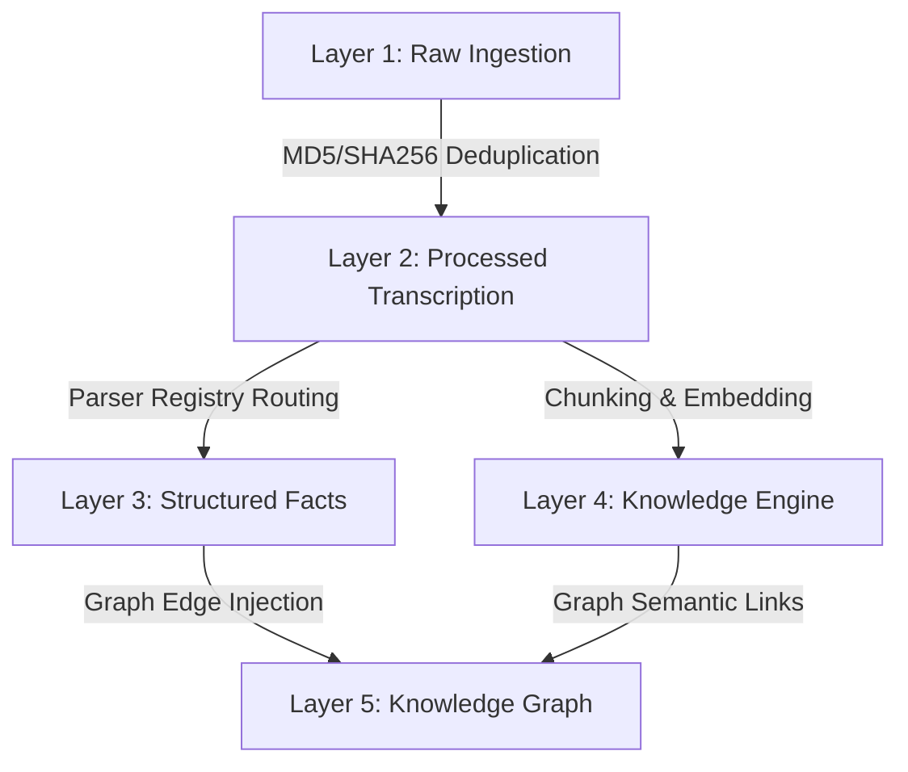

# Enterprise Data Platform Architecture

This document describes the structure and architecture of the Enterprise Data Platform for **CA Intelligence**. 

This platform serves as the permanent data foundation for the application. Rather than executing simple ad-hoc RAG queries, every document, government update, and audit log is transformed into unified, typed structured records that propagate across five storage layers.

---

## The Five Storage Layers

### Layer 1: Raw Data (Ingestion)
- **Role**: Permanent, unaltered storage of raw uploads.
- **Table**: `raw_documents`
- **Supported Formats**: PDFs, Excel files, Word files, images, XML, JSON, ZIPs, emails.
- **Actions**: Validates MIME safety, generates SHA-256 and MD5 hashes, and calculates a SimHash representation of text data.

### Layer 2: Processed Data (Transcription)
- **Role**: Normalized, full-text transcriptions and layouts.
- **Table**: `processed_documents`
- **Actions**: Handles OCR transcription, text layout normalization, and language detection. Contains structured layout representations in JSON (such as table coordinates).

### Layer 3: Structured Facts (Domain Models)
- **Role**: Highly granular database schemas matching accounting and compliance domains.
- **Tables**:
  - `structured_invoice_data`: Extracts vendor, GSTIN, taxable amount, CGST, SGST, IGST, cess, HSN, supply place, and payment states.
  - `structured_notice_data`: Extracts tax assessment years, Section laws, DIN numbers, tax demands, and deadlines.
  - `structured_return_data`: Tracks return categories (ITR-1, GSTR-3B) and filing parameters.
  - `structured_bank_statement`: Individual transaction lines and running balances.

### Layer 4: Knowledge Engine (Semantic Index)
- **Role**: Text fragmentations, summaries, and high-dimensional vector representations.
- **Tables**: `knowledge_chunks`, `embeddings`, `citations`.
- **Actions**: Split text into semantic fragments (paragraphs), generate float vector lists, and log source citations referencing acts or government circulars.

### Layer 5: Knowledge Graph (Relational Mesh)
- **Role**: Multi-tenant entity relational network connecting clients, vendors, government notices, directors, and tax laws.
- **Tables**: `knowledge_graph_nodes`, `knowledge_graph_edges`.
- **Actions**: Maps relationships like `Client -> Filed -> Return` or `Vendor -> Issued -> Invoice` using standard graph nodes and relational edges.

---

## Data Isolation & Security

1. **Strict Multi-Tenant Scoping**: Every table contains an `organization_id` foreign key. Query isolation is enforced in FastAPI dependencies using the JWT authentication scopes.
2. **Universal UUID System**: All database records are keyed by a standard UUID string (36 chars) generated at the point of ingestion.
3. **Immutability & Audits**: Processed fact tables support soft delete and write-ahead logs. The `audit_logs` record the lifecycle of every document.
