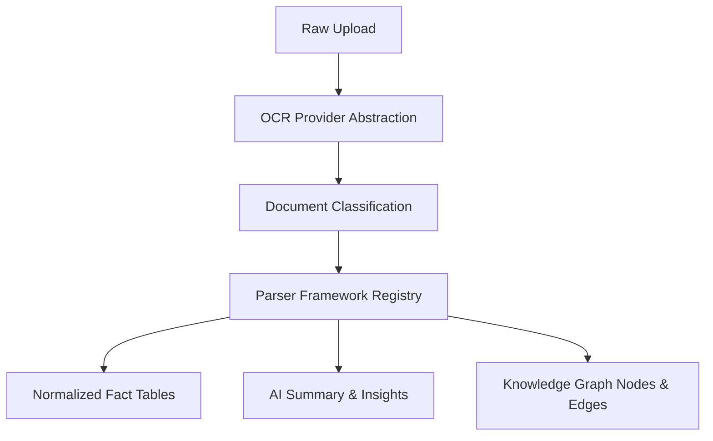

# Document Intelligence Engine

This document provides a technical guide to the Document Intelligence Engine of CA Intelligence.

## Data Processing Pipeline

1. **Upload**: Client document files are uploaded via multipart form data (`/api/v1/documents/upload`).
2. **OCR**: OCR abstraction extracts raw text based on `settings.OCR_PROVIDER`.
3. **Classification**: layout markers, keywords, and filename pattern matching classify documents into one of 20+ supported categories.
4. **Structured Parsers**: BaseParser-derived classes parse the text via regex and layout matches, returning structured JSON schemas.
5. **Database Normalization**: Parses are written to normalized SQL tables instead of bulk JSON dumps.
6. **Knowledge Graph**: PAN, GSTIN, Deductors, Sections, AYs, and circulars are linked automatically as nodes and edges.
7. **Citations**: Trackable compliance snippets are attached to all extracted facts.
8. **AI Summary**: Rule-based summaries produce risk scores, missing info warnings, and suggested actions based on facts.
