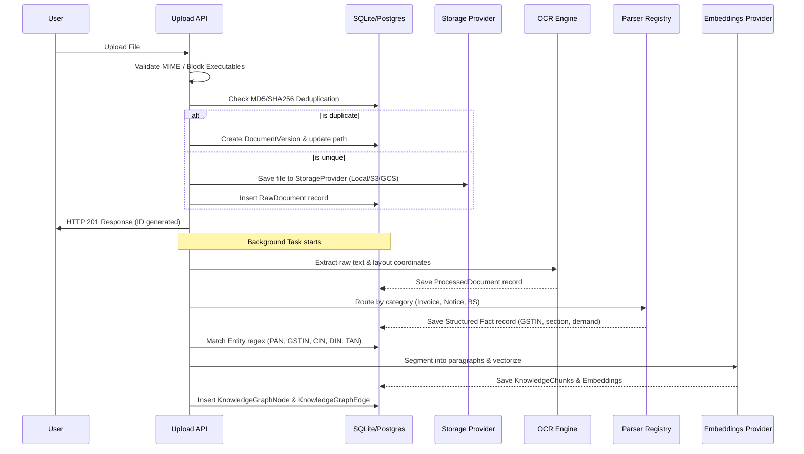

# Document Ingestion & Processing Pipeline

This document describes the design and step-by-step lifecycle of the Document Ingestion & Processing Pipeline in **CA Intelligence**.

---

## Processing Steps

The document processing lifecycle is split into 8 discrete, modular steps. Each step executes in a transaction boundary. If any step fails, the orchestrator catches the exception, records the trace in `processing_errors`, and transitions the state in `processing_pipeline` to `FAILED`.

### 1. Ingestion & Validation
- **Actions**: Validates file extensions (allowing `.pdf`, `.png`, `.jpg`, `.jpeg`, `.xlsx`, `.xls`, `.doc`, `.docx`, `.xml`, `.json`, `.csv`, `.zip`) and file sizes (blocking anything over 10MB).
- **MIME Check**: Prevents dangerous executables or scripts.

### 2. Deduplication Hashing
- **Actions**: The `DeduplicationEngine` calculates SHA-256 and MD5 hashes of the file content.
- **Actions**: Checks if the file already exists under the same `organization_id`.
- **Handling**:
  - If a duplicate is found, it updates the existing record's `version` count, writes a log to `document_versions`, and updates the storage pointer. It avoids writing redundant file duplicates.
  - If unique, a new `RawDocument` record is created.

### 3. File Storage
- **Actions**: Writes the file bytes using the configured `StorageProvider` (Local, S3, Supabase, Azure, or GCS).

### 4. OCR Extraction
- **Actions**: Submits file bytes to the OCR engine to extract raw lines, tables, and text segments. Writes layout coordinates to `processed_documents`.

### 5. Parser Registry Routing
- **Actions**: Identifies the document's category and matches it to a registered parser in the `ParserRegistry`.
- **Actions**: Runs the corresponding class parser (`InvoiceParser`, `NoticeParser`, `BalanceSheetParser`) to extract structured field values and write to specialized fact tables.

### 6. Entity Extraction
- **Actions**: Scours OCR text for standard Indian compliance identifiers using regex patterns (PAN, GSTIN, CIN, DIN, TAN).
- **Actions**: Deduplicates entities under the organization namespace and records node citations.

### 7. Chunking & Embeddings
- **Actions**: Splits full text into paragraph fragments (`KnowledgeChunk`), calls the embedding provider to generate high-dimensional vector representations, and inserts them into `embeddings`.

### 8. Knowledge Graph Mapping
- **Actions**: Inserts graph nodes representing the document, client, and extracted entities. Connects them with edges (such as `Client - Filed - Notice`).

---

## Failure & Retry Logic

- **State Tracking**: Tracked in `processing_pipeline`. Steps are: `UPLOAD` &rarr; `OCR` &rarr; `PARSE` &rarr; `ENTITIES` &rarr; `EMBEDDINGS` &rarr; `GRAPH` &rarr; `COMPLETE`.
- **Failures**: If an exception occurs, the transaction is rolled back, the status is marked as `FAILED`, and a full error traceback is logged to `processing_errors`.
- **Retry Enpoints**: Users can trigger pipeline retries via `POST /api/v1/observability/pipelines/{pipeline_id}/retry`, which resets the status to `PENDING` and spawns a background queue task.
