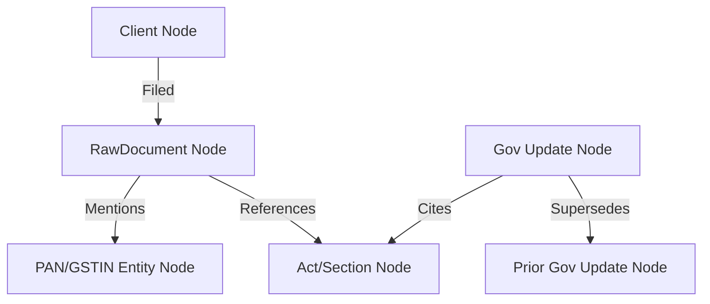

# Knowledge Graph Architecture

This document describes the design, nodes, edges, and multi-tenant scoping of the **Knowledge Graph** in **CA Intelligence**.

---

## Overview

Rather than representing client records and files as disjointed folders, the **Knowledge Graph** links them into an interconnected mesh of entities, documents, tax regulations, and audit parameters. This allows cross-referencing files with statutory guidelines and other client transactions.

---

## Node Schema (`knowledge_graph_nodes`)

Every graph node is represented by a record in the `knowledge_graph_nodes` table.
- **`id`**: Unique UUID primary key.
- **`organization_id`**: Strict tenant ownership boundary.
- **`node_type`**: Category indicating the entity type. Common types:
  - `Client`: Client entity (linked to `clients`).
  - `RawDocument`: Uploaded document (linked to `raw_documents`).
  - `Notice`: Tax notices.
  - `Act` / `Section` / `Rule`: Regulatory statutory node.
  - `Vendor`: Company providing invoices.
  - `Director`: Individuals holding corporate DINs.
- **`label`**: Display name for the node.
- **`properties_json`**: Dynamic JSON dictionary capturing fields (such as phone numbers, dates, or registration numbers).

---

## Edge Schema (`knowledge_graph_edges`)

Edges define directed, typed relationships connecting two nodes.
- **`id`**: Unique UUID primary key.
- **`organization_id`**: Strict tenant boundary.
- **`source_node_id`**: Foreign key to the origin node.
- **`target_node_id`**: Foreign key to the destination node.
- **`relationship`**: Type of semantic connection. Common relationships:
  - `Filed`: Connects `Client -> RawDocument`.
  - `Mentions`: Connects `RawDocument -> Entity (PAN/GSTIN)`.
  - `References`: Connects `RawDocument -> Act/Section`.
  - `Issued`: Connects `Vendor -> Invoice`.
  - `DirectorOf`: Connects `Director -> Company`.
  - `Supersedes`: Connects `GovernmentUpdate -> GovernmentUpdate` (used to mark updated circulars).
- **`properties_json`**: Metadata about the connection (such as timestamp or transaction amount).

---

## Citations & Entities

Citations form the linking logic connecting raw document paragraphs (`knowledge_chunks`) to core graph nodes.
- **Citations Table (`citations`)**: Holds logs mapping `source_document_id` (raw document or government circular) to `target_entity_id`. This provides verification links so users can see exactly which paragraph in a notice or act cited a specific PAN, GSTIN, or liability.
- **Entities Table (`entities`)**: Unique, unified cache of extracted identifiers (PANs, GSTINs, CINs, DINs, TANs). By mapping unique entities to multiple documents, the system can display all notices, filings, and audit records associated with a client's GSTIN or PAN across the entire tenant history.
