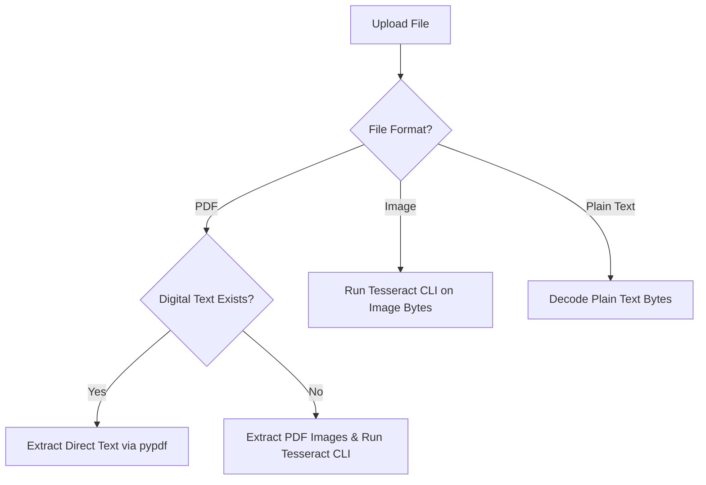

# OCR Architecture

CA Intelligence utilizes a modular OCR abstraction layer allowing dynamic provider configurations and local offline fallbacks.

## OCR Provider Abstraction

All providers inherit from the `OCRProvider` base class and implement:
```python
def extract_text(self, file_content: bytes, file_name: str) -> str:
    ...
```

### Supported Providers
1. **Google Document AI** (`google`): Enterprise document processor.
2. **AWS Textract** (`aws`): AWS text and tabular extractor.
3. **Azure Document Intelligence** (`azure`): Microsoft cognitive service.
4. **Gemini Vision** (`gemini`): Google multimodal vision agent.
5. **OpenAI Vision** (`openai`): OpenAI vision model.
6. **Tesseract OCR** (`tesseract`): Local command-line engine fallback.

## Local Fallback Processing Logic



If the configured cloud provider fails or lacks credentials, the system automatically catches the exception and falls back to the **Local Tesseract OCR Engine**, invoking the system's `tesseract` binary via subprocesses. This guarantees high resilience and prevents layout information loss.
