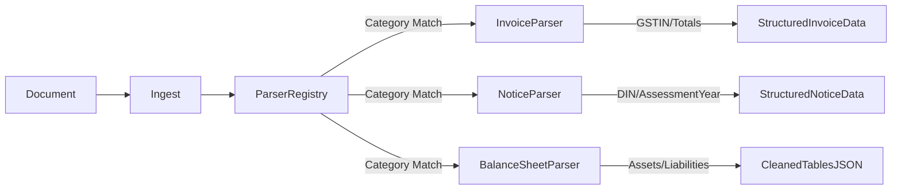

# Parser Architecture

This document describes the design, extension model, and startup registry of the Document Parsers in **CA Intelligence**.

---

## Technical Overview

The system uses a **Parser Registry** pattern to select and route documents to specialized parsers based on the file category or metadata.



---

## Extension Interface (`BaseParser`)

Every parser must inherit from the abstract class `BaseParser` inside `app.services.parsers` and implement two abstract methods:

```python
from abc import ABC, abstractmethod
from typing import Dict, Any

class BaseParser(ABC):
    @abstractmethod
    def parse(self, text: str) -> Dict[str, Any]:
        """
        Processes OCR text and returns a dictionary matching the database fields.
        """
        pass

    @abstractmethod
    def get_document_type(self) -> str:
        """
        Returns the category name representing this parser (e.g., 'Invoice', 'Notice').
        """
        pass
```

---

## Core Parsers & Extracted Schemas

### 1. Invoice Parser (`InvoiceParser`)
Matches files containing keywords like "invoice", "receipt", "bill", "taxable invoice".
- **Fields Extracted**:
  - `GSTIN`: Standard 15-character Indian GST identifier.
  - `vendor_name`: Vendor or legal entity issuing the invoice.
  - `invoice_number`: Billing invoice identifier.
  - `invoice_date`: Ingestion date.
  - `hsn_code`: HSN/SAC code of service or item.
  - `taxable_value`: Net value before GST.
  - `cgst` / `sgst` / `igst`: State/Central/Integrated tax amounts.
  - `total_amount`: Cumulative sum (Taxable Value + CGST + SGST + IGST).
  - `currency`: Defaults to `INR`.
  - `place_of_supply`: Region of state supply.
  - `payment_status`: Defaults to `PENDING`.

### 2. Notice Parser (`NoticeParser`)
Matches files containing keywords like "notice", "demand", "income tax department", "din".
- **Fields Extracted**:
  - `din`: Document Identification Number issued by IT Dept.
  - `section`: Law section (e.g. Section 143(1), Section 148).
  - `assessment_year`: Format e.g. `2025-26`.
  - `issuing_authority`: Defaults to "Income Tax Department of India".
  - `tax_demand_amount`: Outstanding tax liability demanded.
  - `due_date`: Date limit for compliance.
  - `issues_identified`: JSON array listing compliance mismatches.
  - `response_deadline`: Limit to reply.
  - `reply_draft`: Initial mock template for rectification.

### 3. Balance Sheet Parser (`BalanceSheetParser`)
Matches files containing keywords like "balance sheet", "equity", "assets", "liabilities".
- **Fields Extracted**:
  - `equity_share_capital`: Subscribed share capitals.
  - `reserves_and_surplus`: Unallocated profits or reserves.
  - `non_current_liabilities` / `current_liabilities`: Total debts.
  - `fixed_assets` / `current_assets`: Total resource values.
  - `total_assets` / `total_liabilities`: Integrity totals check.

---

## Adding a New Parser

To add a new parser (e.g. a `GSTReturnParser` to parse GSTR-3B filings):
1. Create a subclass implementing `BaseParser`:
   ```python
   class GSTReturnParser(BaseParser):
       def get_document_type(self) -> str:
           return "GSTR-3B"
       def parse(self, text: str) -> dict:
           # regex parsing rules ...
           return {...}
   ```
2. Register the class inside `ParserRegistry` at application startup:
   ```python
   ParserRegistry.register("GSTR-3B", GSTReturnParser)
   ```
   *Note: This makes it automatically discoverable by the `/api/v1/observability/stats` registry listing.*
