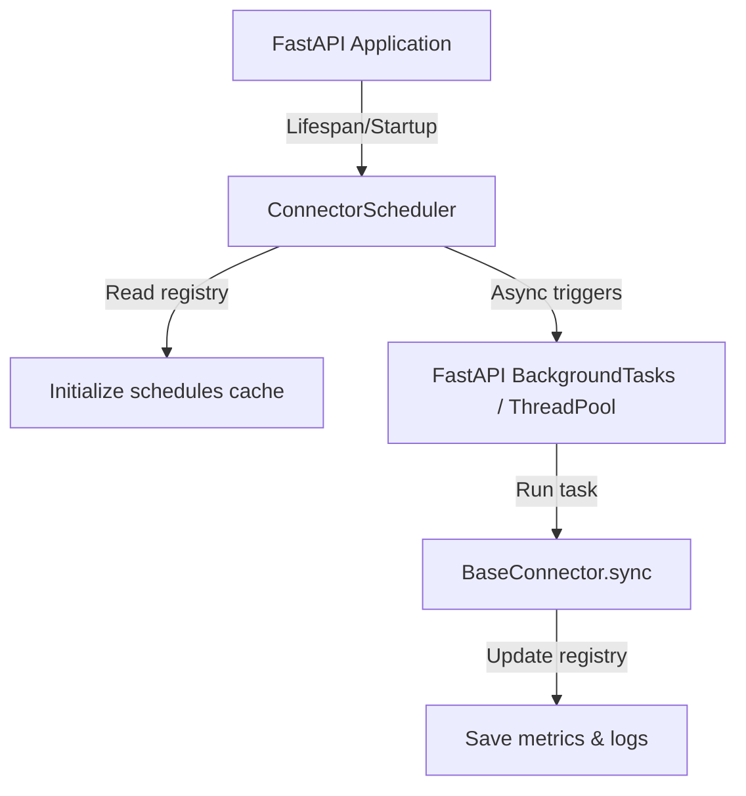

# Scheduler Architecture Spec

This document describes the design, task queue, and runtime execution of the **Compliance Source Ingestion Scheduler** in **CA Intelligence**.

---

## Technical Design

The scheduler is designed to trigger ingestion sync tasks periodically. To avoid tight coupling with specific distributed queue managers (like Celery, RQ, or Huey) during early-stage development, the scheduler leverages a decoupled manager:

---

## Scheduler Manager (`ConnectorScheduler`)

The `ConnectorScheduler` class inside `app.services.scheduler` controls job states:
- **`initialize_schedules(db: Session)`**: Queries `government_sources` to load current crawler schedules and statuses.
- **`trigger_sync_async(connector_name: str)`**: Spawns a daemon thread `threading.Thread` to execute sync tasks in the background without blocking FastAPI's main request loop.
- **`pause_schedule(connector_name: str, db: Session)`**: Sets the database connector status to `PAUSED`. The ingestion loop checks this state and skips execution if paused.
- **`resume_schedule(connector_name: str, db: Session)`**: Resumes the ingestion schedule by updating the state to `RUNNING` in the database.
- **`update_frequency(connector_name: str, frequency: str, db: Session)`**: Dynamically alters sync schedules.

---

## Supported Frequencies

The system supports the following scheduling configurations:
- **`MANUAL`**: Sync is only triggered when requested via the Admin Panel dashboard.
- **`HOURLY`**: Crawler executes once every 60 minutes.
- **`DAILY`**: Ingestion runs once every 24 hours.
- **`WEEKLY`**: Sync runs once every 7 days.
- **`CRON`**: Integrates standard 5-field cron schedules.

---

## Distributed Workers Roadmap

In enterprise production deployments, the `ConnectorScheduler` interfaces will map directly to distributed queues:
- **Celery Beat**: Map `ConnectorScheduler.update_frequency` to Celery Beat database schedules (`django-celery-beat` or redis beat).
- **Apscheduler**: Leverage a background APScheduler running alongside the worker services.
- **Cron Jobs**: Run `python manage.py run_connector <connector_name>` using standard system-level cron jobs.
