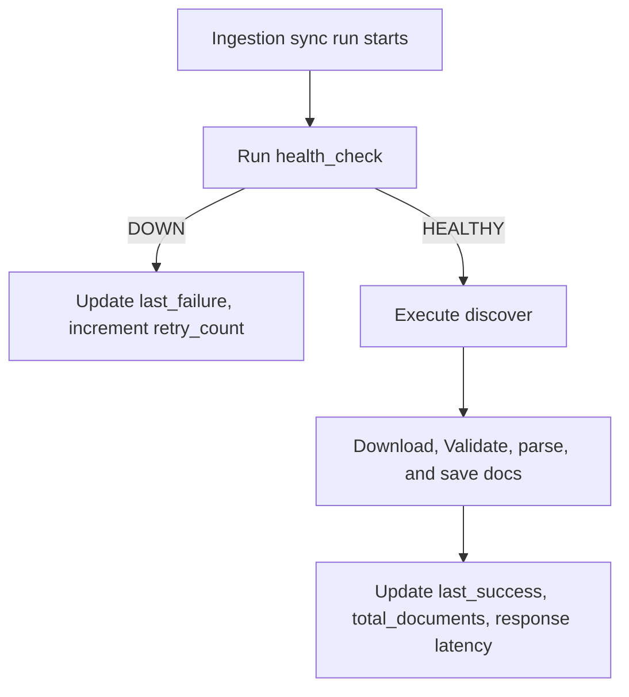

# Compliance Source Registry Spec

This document details the registry mechanism that tracks crawl frequencies, latencies, error states, and health conditions of all active government connectors.

---

## Registry Ingestion Loop

The registry operates out of the `government_sources` table and updates during scheduled runs.

---

## DB Registry Schema

Registry metrics are maintained in the database:

| Column | Type | Default | Description |
| :--- | :--- | :--- | :--- |
| `health` | String | `'HEALTHY'` | Ingestion status (`HEALTHY` or `DEGRADED`) |
| `sync_frequency` | String | `'DAILY'` | Frequency pattern (`DAILY`, `HOURLY`, or Cron) |
| `last_success` | DateTime | `NULL` | Timestamp of last successful connector execution |
| `last_failure` | DateTime | `NULL` | Timestamp of last recorded crawl error |
| `average_response_time`| Float | `0.0` | Running average of sync latency (in ms) |
| `retry_count` | Integer | `0` | Consecutive failed runs before alert trigger |
| `total_documents_count`| Integer | `0` | Total unique crawled items |
| `version_count` | Integer | `0` | Total revision versions detected |
| `connector_status` | String | `'RUNNING'` | Sync control status (`RUNNING` or `PAUSED`) |
| `auth_requirements` | String | `'NONE'` | Credential configuration parameters |
| `rate_limits` | String | `'60/minute'`| Maximum requests limit |

---

## Ingest Logs (`connector_sync_logs`)

Each sync execution is recorded in the `connector_sync_logs` table:
- **`status`**: Success/Failure status indicator.
- **`documents_downloaded`**: Number of new/versioned files processed in the run.
- **`error_message`**: Captures HTTP, parsing, or file save exceptions.
- **`duration_ms`**: Ingestion runtime duration in milliseconds to monitor crawler performance.
